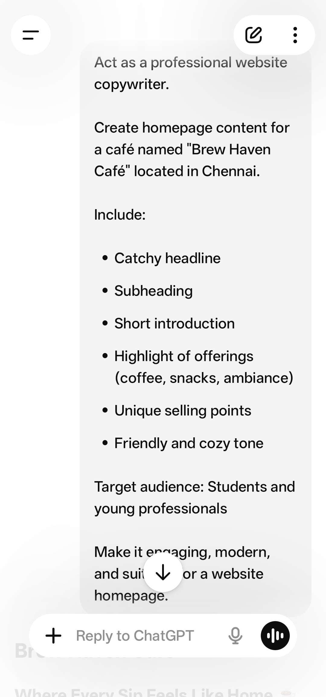
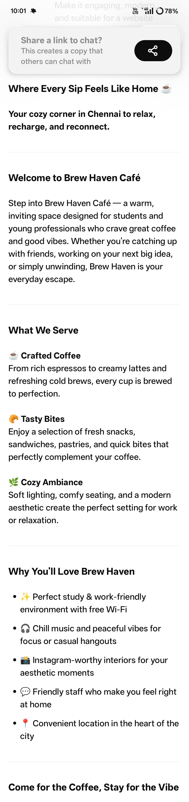
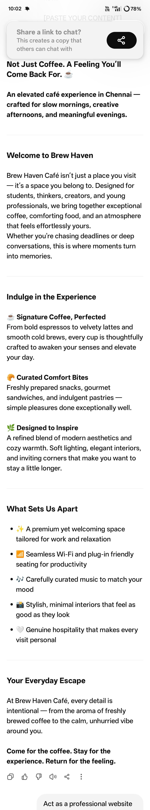
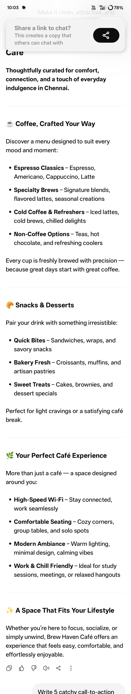

# FUTURE_PE_01

## Project Title
AI Website Copy Generator using Prompt Engineering

## Objective
To generate high-quality website content for local businesses using structured AI prompts.

## Tools Used
- ChatGPT
- GitHub

## Project Description
This project focuses on creating website content such as homepage, services page, and call-to-action sections using prompt engineering techniques.

## Workflow
1. Designed structured prompts
2. Generated AI outputs
3. Improved content quality
4. Documented results

## Author
Swathi K
## 📸 Screenshots

### Homepage Prompt

### Homepage Output

### Improved Version

### Services Page

### CTA Section

